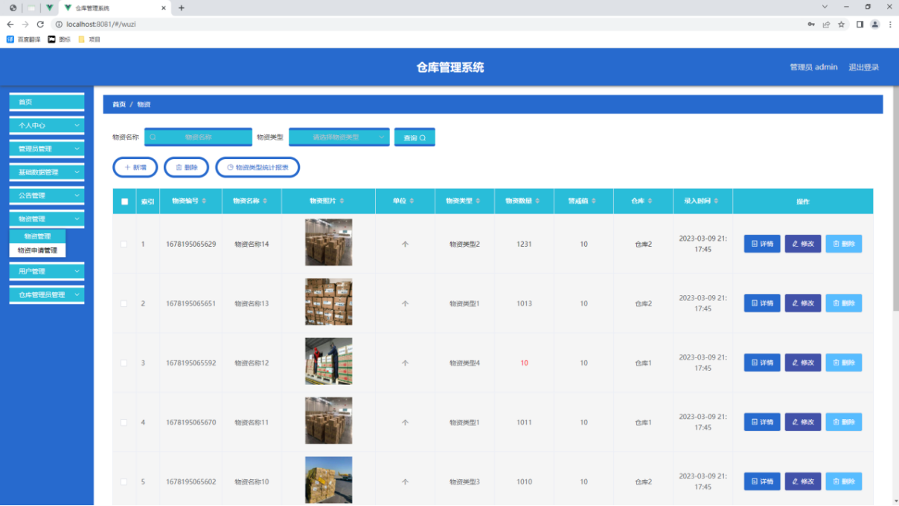
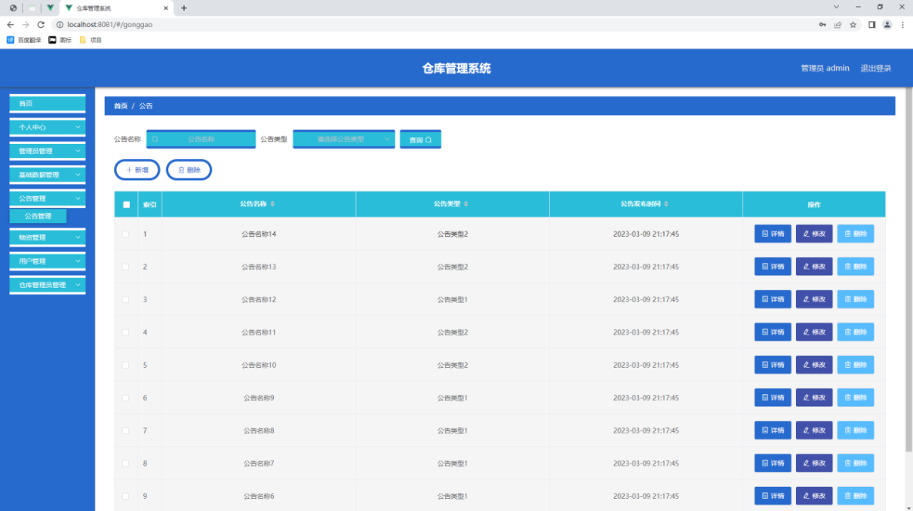
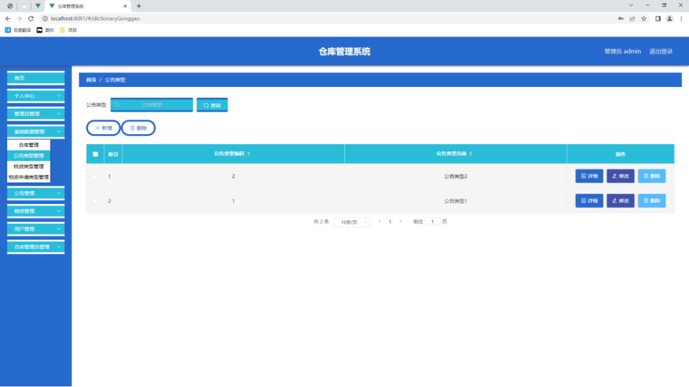
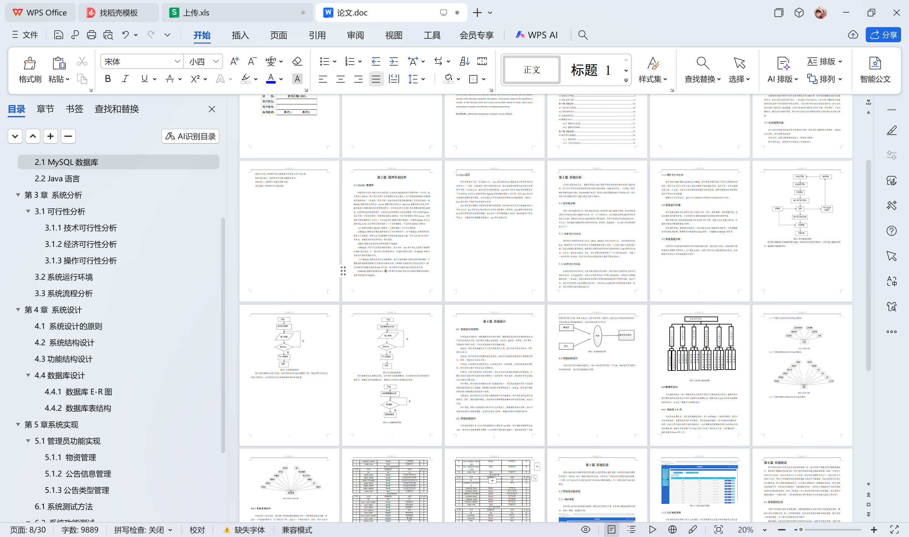

# springboot201-基于SpringBoot的仓库管理系统

>  博主介绍：
>  Hey，我是程序员Chaers，一个专注于计算机领域的程序员
>  十年大厂程序员全栈开发‍ 日常分享项目经验 解决技术难题与技术推荐 承接各类网站设计，小程序开发，毕设等。
>  【计算机专业课程设计，毕业设计项目，Java，微信小程序，安卓APP都可以做，不仅仅是计算机专业，其它专业都可以】

## 3000套系统可挑选，获取链接：https://chaerspol.github.io/

<b>QQ【获取完整源码】：674456564</b>

<b>QQ群【获取完整源码】：1058861570</b>

### 系统架构

> 前端：html | js | css | jquery | vue
>
> 后端：springboot | mybatis
> 
> 环境：jdk1.8+ | mysql | maven

# 一、内容包括
包括有  项目源码+项目论文+数据库源码+答辩ppt+远程调试成功

# 二、运行环境

> jdk版本：1.8 及以上； ide工具：IDEA； 数据库: mysql5.7及以上；编程语言: Java

# 三、需求分析

**3.1可行性分析**

开发一款系统软件之前，用户都会思考这个软件程序值不值得去开发，把开发软件过程中可能涉及到的问题罗列出来，并一个个分析解决，以此来确定开发这款程序软件是否有必要，这样的分析方法也能帮助用户降低损失，不至于开发者开发进度进行到一半之后，突然遇到问题就放弃对软件的开发，到那时，资金损失，人力投入等方面就损耗太大了。

**3.1.1技术可行性分析**

开发程序中常用的开发工具有：IDEA，MySQL和其它专用工具，应用开发知识是Java，挑选开发工具开发知识是在大学课堂接触和学习培训，之后因为她们也比较感兴趣，因此也根据互联网渠道，或依靠公共图书馆开发书本系统软件学习app开发专业知识，让你有一定的知识储备，此外，我上学期间单独开发了一些手机软件著作，积累了一定的开发工作经验，所以今天毕业作品制作技术层面不用过度担心。

**3.1.2经济可行性分析**

在现阶段的信息化时代，信息化管理趋向安全高效，那也是电子计算机全力普及化带来的好处。在设备选择上，该程序手机软件取决于平民化电脑设备，对电脑主机配置要求较低。一般来说，院校计算机机房的电子计算机能够满足程序开发的需求。除此之外，该程序的开发使信息资源管理高效率，其高效化远远超过程序开发的降低成本。因而，程序开发的资金分配忽略不计。

**3.1.3操作可行性分析**

程序软件的操作面板满足群众审美要求，程序模块的规划相近于国家上同样类别的软件，因而大家可以在并没有学习培训的情形下实际操作软件。除此之外，如今计算机已进入每一个家庭，大部分人的计算机实际操作水准也较高，这样的事情也证明研发的程序不用担心使用难题。
根据以上可行性论证，基本上可以知道程序开发设计是绝对切实可行的。

**3.2系统运行环境**

程序能通过编号来达到程序设计方案的功效。可是，编号需要一定的配置环境，包含计算机里的硬件环境，及其安装于计算机电脑操作系统里的软件自然环境。
硬件环境:笔记本电脑或电脑能正常启动和手机上网，电脑运行内存最少要4G，计算机的微处理器能够配备i5CPU。
软件自然环境：微软操作系统是一个较为稳定win7旗舰级系统软件，应用更娴熟的360极速浏览器，根据网页下载组装Eclipse软件，下载最新版MySQL软件等。

**3.3系统流程分析**

分析程序的过程牵涉到程序的总体实际操作过程。通过对比与设计，绘制的程序实际操作过程图如下图所示。为了能保证安全，该程序用户可以登录模块验证消息，符合要求的消费者有权利实际操作该程序。

# 四、功能模块

在确认管理员功能模块基础上，设计方案管理员的每一个功能，明确管理员功能的具体控制模块。管理员功能构造见下图。

# 五、效果图展示【部分效果图】

图5-1 物资管理页面【此页面让管理员管理物资的数据，物资管理页面见下图。此页面主要实现物资的增加、修改、删除、查看的功能。】

图5.2 公告信息管理页面【公告信息管理页面提供的功能操作有：新增公告，修改公告，删除公告操作。下图就是公告信息管理页面。】

图5.3 公告类型列表页面【公告类型管理页面显示所有公告类型，在此页面既可以让管理员添加新的公告信息类型，也能对已有的公告类型信息执行编辑更新，失效的公告类型信息也能让管理员快速删除。下图就是公告类型管理页面。】

 <b>完整文章</b>
 

 

## 3000套系统可挑选，获取链接：https://chaerspol.github.io/

<b>QQ【获取完整源码】：674456564</b>

<b>QQ群【获取完整源码】：1058861570</b>

